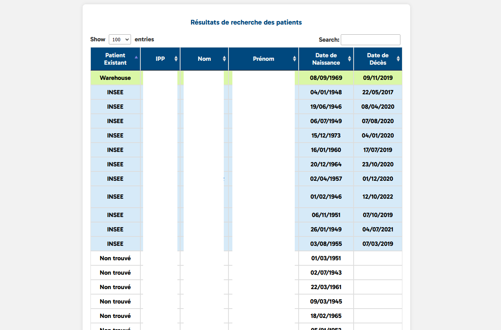

# VitaInspect

## Project Description 🏨

This Django web application is designed to facilitate the updating of patient death records for Hôpital Foch. The system fetches data from INSEE (the French National Institute of Statistics and Economic Studies) to provide a reliable source of information for medical professionals and researchers. Once the data is processed and updated, it is automatically synchronized with the Oracle database of Hôpital Foch.

    

## Features 🚒

- Automated Data Retrieval: The system automatically downloads updated files from INSEE, ensuring that the most recent records are always available.
- Data Parsing: Extracts and formats relevant details such as patient name, date of birth, birthplace, and date of death from the downloaded files.
- Django Integration: Seamlessly integrates with the Django web application, allowing easy management and data import operations.
- Oracle Database Synchronization: After processing, the application ensures that the Oracle database of Hôpital Foch is up-to-date with the latest records.
- Search Engine: Users can search for specific patient records using criteria such as name, first name, and date of birth. 

    

    

## TODO: 📝

- Probabilistic algorithm to infer individuals whose birth name is unknown based on their place of birth and other available information.

## Acknowledgments 💊
This project fetches data from [INSEE's dataset on deceased individuals](https://www.data.gouv.fr/fr/datasets/fichier-des-personnes-decedees/).

